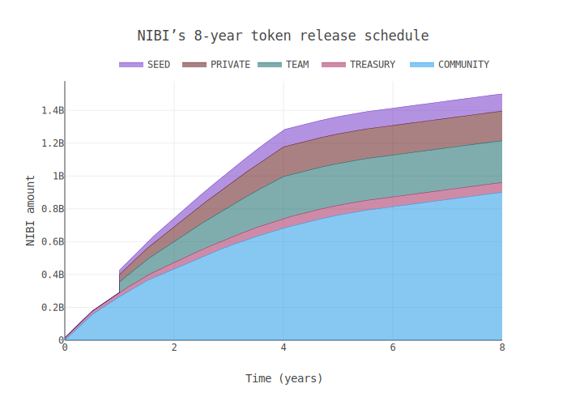

# matrix-research

### [Nibiru Protocol (Blog)][blog-matrix]

### [NIBI Tokenomics (Blog)][blog-tokenomics]

[blog-matrix]: https://github.com/NibiruChain/research/blob/main/blog-posts/blog-matrix.pdf
[blog-tokenomics]: https://github.com/NibiruChain/research/blob/main/blog-posts/blog-tokenomics.pdf

### Token Release

| Split (%) | Group | Description | Schedule  
| :---: | :----: | ---- | ---- | 
| 60 | Community | NIBI Liquidity Mining Program on Osmosis | Ongoing allocation with taper similar to Juno or Curve |
| 17 | Team | Core Nibiru development team | 1 year cliff, then 3 year linear vest |
| 12 | Early Backers / Private | Strategic partners and private investors | 1 year cliff, then 3 year linear vest |
| 7 | Seed | Supportes of the initial development and launch to mainnet | 1 year cliff, then 3 year linear vest |
| 4 | Treasury | Discretionary fund managed by members of the core team, the community, and select professional advisors | Genesis initialization at 25% of the allocation (i.e., 1% of the supply), then 4 year linear vest |

As more tokens are released into the ecosystem, the distribution will eventually rest mostly in the hands of the community.

