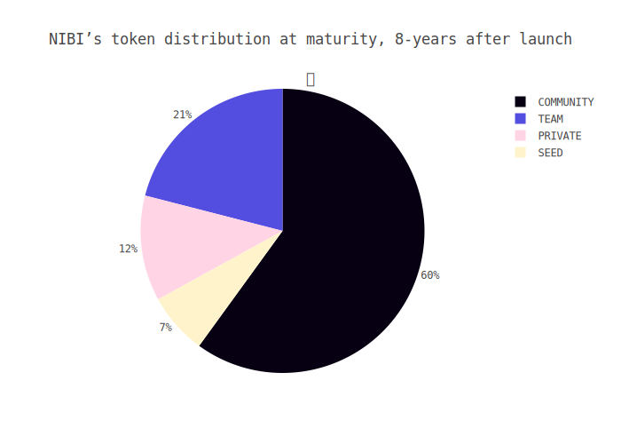

# matrix-research

### [Matrix Protocol (Blog)][blog-matrix]

### [MTRX Tokenomics (Blog)][blog-tokenomics]

[blog-matrix]: https://github.com/NibiruChain/matrix-blog/blob/main/blog-posts/blog-matrix.pdf
[blog-tokenomics]: https://github.com/NibiruChain/matrix-blog/blob/main/blog-posts/blog-tokenomics.pdf

### Token Release

| Split (%) | Group | Description |  
| :---: | :----: | ---- | 
| 40 | Community | MTRX Liquidity Mining Program on Osmosis |
| 20 | Community | Treasury controlled through Matrix DAO | 
| 15 | Community | Strategic partners, project advisors, and community members that contribute a lot to the protocol   | 
| 15 | Core | Core Matrix Team | 
| 10 | Early Backers | Initial DEX offering (IDO), Seed funding | 

As more tokens are released into the ecosystem, the distribution will eventually rest mostly in the hands of the community.

