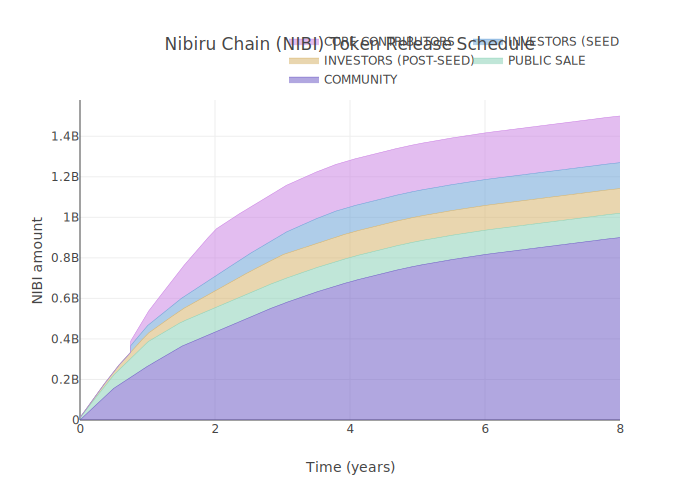

### [NIBI Tokenomics (Blog)][blog-tokenomics]

[blog-tokenomics]: https://nibiru.fi/blog

### Token Release

| Split (%) | Group | Description | Schedule  
| :---: | :----: | ---- | ---- | 
| 60   | Community | NIBI Liquidity Mining Program on Osmosis | Ongoing allocation with taper similar to Juno or Curve |
| 19   | Team | Core Nibiru development team | 1 year cliff, then 3 year linear vest |
| 10.5 | Early Backers / Private | Strategic partners and private investors | 1 year cliff, then 3 year linear vest |
| 8.5  | Seed | Supportes of the initial development and launch to mainnet | 1 year cliff, then 3 year linear vest |

As more tokens are released into the ecosystem, the distribution will eventually rest mostly in the hands of the community.

