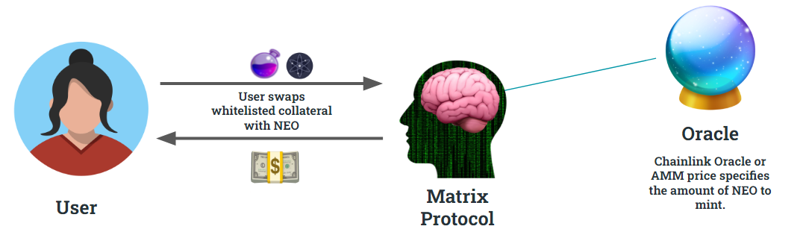

# Vision for Matrix Protocol

Tags: Blockchain, Cryptocurrency, Cosmos, Stablecoin  
Description: Insights on the Matrix protocol taken from the official whitepaper.

## What is the Matrix protocol?

Matrix is a capital efficient, decentralized protocol for creating stable crypto assets that can be traded on the blockchain. It allows **stable seekers** to convert collateral into stable assets.

## NEO Token - The Cosmos-native stablecoin

Matrix will mint **NEO**, a stablecoin backed by collateral in the form of OSMO and ATOM. Eventually, the protocol will allow for other tokens to be used as collateral from a governance-made whiteliste. These tokens are priced at [Chainlink](https://chain.link/) oracle value and swap with a minimal amount of transaction fees, which go to the protocol. Collateral can always be swapped with its corresponding stablecoin at oracle value.

Stables assets are minted whenever whitelisted collateral is sent to the protocol. Whenever stable assets are instead sent to the protocol in exchange for collateral, the stablecoins are burned. These transactions are always executed without price slippage but with a small transaction fee to prevent front-running and flash loan attacks, support the robustness of the protocol, and compensate liquidity providers.

## How will the token stability be guaranteed? 

#### Matrix DAO

In order for users of Matrix protocol to be guaranteed the option of swapping between collateral and stablecoins, the protocol must remain **over-collateralized**. This problem is addressed through Matrix DAO's **Incentive Pendulum**, a system designed to incentivize liquidity providers (LPs) and drive the utility of the Neo token. 

Matrix gets its liquidity from two places: LPs and the **Insurance Fund (IF)**, a reserve fund for the protocol. At genesis, Matrix DAO's assets are divided between LPs and the IF. From that moment on, the DAO splits profits from wagering based on an imbalance factor $\Xi^{-1}$:

$$\Xi^{-1} = \frac{\text{LP} - \text{IF}}{\text{LP} + \text{IF}},$$

where $LP$ and $IF$ are the asset contributions from the liquidity providers and Insurance Fund, respectively. The value of $\Xi^{-1}$ determines the state of the protocol. For example, 
- **Optimal**, $\Xi^{-1} = \frac{1}{3}$: The desired state, where 67% of the assets are provided by LPs and 33% are provided by the IF. The rewards from the protocol are split with the same proportions.
- **Under-utilized**, $\Xi^{-1}=0$ : An unsafe state. Here, both LPs and the IF provide 50% of the assets each. 100% of the rewards go to the IF (i.e. no rewards go to LPs). If the protocol is under-utilized, stakers have no incentive to validate the block-chain.
- **Inefficient**, $\Xi^{-1}=1$: LPs provide 100% of the assets and receive 100% of the protocol rewards. When the protocol becomes inefficient, capital and rewards are re-allocated by the DAO between LPs and the IF to bring about additional investment yields, moving the protocol closer to optimality.

## Matrix Liquidity Providers

#### Leverage Agents

**Leverage Agents (LAs)** insure the protocol against drops in collateral price, making sure that there are always reserves for stable holders. Similar to the liquidity positions of Uniswap, liquidity agent positions are implemented as NFTs. These positions are transferable between addresses and cover fixed amounts of liquidity ($c_{\text{cover}}$).

**LAs choose how much collateral they want to cover** for stable seekers and essentially take a long investment on the underlying collateral. A leverage agent's position can be redeemed in the form of collateral (token) it covers based on the following equation:

$$
\text{position\_value}(t, t_0) = c_{\text{cover}}\cdot \left( 1 - \frac{\text{price}(t_0)}{\text{price}(t)}  \right) + c_{LA},
$$
where $t_0$ and $t$ represent the times of position entrance and exit, $c_{LA}$ is the collateral the agent brings to the protocol, and $c_{\text{cover}}$ is the amount of collateral the agent chooses to cover.

LAs' investments absorb the volatility of the amount they are backing by enabling the protocol to use their collateral in the case of price drops, effectively reducing the exposure of Matrix to price variations. From the perspective of an agent, one gets great earnings in the case of a price increase and suffers substantial losses if price decreases.

##### Constraints on leverage agents:

- There's a one-hour lock on an LA's position after each update. This prevents LAs from taking advantage of unfair advantages from knowledge surrounding price movements.
- LAs pay small transaction fees when entering and exiting positions with the protocol based on coverage curves. If more collateral is covered, it becomes more expensive to provide liquidity as an LA but less expensive to exit a position.

In the case the protocol's stable seekers are entirely covered by LAs, there would be perfect convertibility between Matrix stablecoins and their corresponding collateral. BAut what happens in the case that LAs' positions and protocol's insured reserves can't cover the collateral brought by users? You can imagine a scenario where the LAs all get liquidated and the protocol gets under-collateralized. Matrix makes use of another type of liquidity provider known as an Insurance Agent in order to prevent this.

#### Insurance Agents

**Insurance Agents (IAs)** ensure the collateralization of the protocol when there's a mismatch between user demand and the liquidiity provided by Leverage Agents. Insurance agents provide extra liquidity to the protocol and accrue interest on the assets they bring. 

There are several revenue streams for providing liquidity as an Insurance Agent:
1. **Transaction fees**: In proportion to their position size, IAs receive a cut of the transaction fees when stablecoins are minted and burned.
2. **Staking**: IAs can stake their liquidity positions to receive governance tokens.
3. **Reserve pool investments:** Stable seekers bring collateral to the Matrix protocol and this will often result in an under-utilization of the assets. In similar fashion to how the surplus from [Curve pools](https://resources.curve.fi/base-features/understanding-curve) are used on lending protocols like Compound and Aave or other yield aggregation protocols, **Matrix will automatically transfer some its extra reserves into trading strategies** on platforms like Umee and Axelar. IAs earn interest from this. 

For example, suppose the protocol owns 15 OSMO (collateral), of which 10 comes from stable seekers and 5 comes from liquidity providers. Insurance Agents can earn interest from all of this. This interest depends on what proportion of the protocol funds are invested in strategies and what proportion of the liquidity is supplied by other IAs.

To be clear, IAs are in competition with each other. The less liquidity there is coming from IAs in the protocol, the more a single agent earns from each revenue stream: transaction fees, staking governance tokens, and investment yields.

An IA providing OSMO/ATOM liquidity for the NEO stablecoin would receive sanOSMO, a tokens that quantify the rewards. By issuing sanOSMO, IAs can earn interest and rewards through the token's underlying Osmosis exchange rate, which increases as transaction fees collect for the pool and increases as interest is collected from lent collateral.

**Risks for Insurance Agents**: The risk for an Insurance Agent is incurring slippage when the protocol is under collateralized, i.e. not being able to reclaim assets with the same value they put in.  

<!--  -->

## Partners (ask if this should be included)
- Osmosis

*Disclaimer: This content is provided for informational purposes only, and should not be relied upon as legal, business, investment, or tax advice. You should consult your own advisers as to those matters. References to any securities or digital assets are for illustrative purposes only, and do not constitute an investment recommendation or offer to provide investment advisory services. This content is not directed at nor intended for use by any investors or prospective investors, and may not under any circumstances be relied upon when making investment decisions.*

<!--
- [ ] TODO | link to whitepaper
- [ ] TODO | link to project's Twitter
  -->
